<picture>
  <source media="(prefers-color-scheme: dark)" srcset="assets/logo-lockup-dark.png">
  
</picture>

A chief of staff for Claude Code in [herdr](https://herdr.dev). One Claude session named athena, in a herdr space of the same name, takes Linear tickets, launches a visible worker Claude for each in its own git worktree and herdr space, shows the workers as columns beside itself, and supervises them to merge-ready PRs. The human can type into any worker at any time.

Design and decisions: `docs/decisions.md`. Plan: `docs/plans/2026-10-07-athena-v1.md`.

## What it looks like



athena sits in its own space with the workers as columns beside it. It launches each ticket with a launch card, and when a worker gets stuck or finishes, a watch line appears and athena acts on it. When a worker needs a decision, athena asks you in its own pane and passes your answer on. Each worker is a full Claude session, so you can also type into its column directly.



A ticket becomes a brief and a worker in its own worktree. The worker builds, tests, pushes and opens a draft PR. athena checks CI, has a fresh reviewer read the diff, and sends findings back until the PR is ready. Then it asks you: you merge, or tell athena to.


`athena watch` prints one line per change, and athena reacts to each: it asks you about a blocked worker, sends a failed check back to its worker, starts a review on DONE, and asks a repo's workers to rebase when its main moves. Routine progress stays quiet.

## Use

- `prefix+shift+c` (or `athena hq`): open or focus the hq space. The chief of staff starts with its brief (`hq.md`) and the `athena` skill.
- Tell it what to start: "start abc-101 and abc-102". It reads Linear, writes a brief, shows a launch card, and runs `athena spawn`.
- `prefix+shift+b` (or `athena board toggle`): show or hide the worker columns beside hq.

## Commands

| Command | What it does |
|---|---|
| `athena preflight <repo>` | Main checkout clean, on main, fast-forwarded |
| `athena spawn --repo --branch --name --brief --goal ...` | Worktree space, worker Claude (`--name`, `worker.md`, per-worker settings), then its `/goal` |
| `athena status [--json] [--pr]` | Merged status: ATHENA-REPORT, hook state, git, PR, herdr |
| `athena board on\|off\|toggle\|sync\|show` | Attach columns beside hq; a watcher keeps them in step with width and workers |
| `athena watch` | One line per change, for Monitor |
| `athena pr <name>` | PR summary |
| `athena nudge <name> <text>` | Type a slash command into a worker |
| `athena retire <name> [--force] [--keep-worktree]` | Back up, refuse to lose work, stop, remove the worktree space |
| `athena hq` | Create or focus hq |

## Pieces

- `athena_lib/`: stdlib Python 3.9+. State in `~/.local/state/athena/` (`ledger.jsonl`, `workers/`, `briefs/`, `settings/`, `claims/`, `board.json`, `hq.json`).
- `hooks/`: Claude Code plugin hooks that write `workers/<name>.json`; a no-op outside athena workers.
- `hq.md`, `worker.md`, `skills/athena/SKILL.md`: the prompts.
- `repos/<repo>.setup`: optional per-repo worktree setup (platform: env files, certs, `pnpm install`).
- The herdr auto-claude plugin skips spaces that `athena` claims (`~/.local/state/athena/claims/`).

## Install

```sh
ln -sf ~/Developer/athena/bin/athena ~/.local/bin/athena
claude plugin marketplace add ~/Developer/athena
claude plugin install athena@athena
```

## Test

`make test` (unit tests with a fake herdr). `tests/lab/` runs real workers against an isolated herdr server.

## Environment

`ATHENA_STATE_DIR`, `ATHENA_WORKTREE_ROOT` (default `~/Developer/.worktrees`), `ATHENA_HERDR`, `ATHENA_HQ` (default `athena`), `ATHENA_MIN_COL` (70), `ATHENA_MAX_WORKERS` (4, hard cap 5), `ATHENA_PLUGIN_DIR` (load the plugin from a directory in workers), `ATHENA_HQ_PANE`.

## Update after editing

The `athena` CLI and the prompt files (`hq.md`, `worker.md`) run from this repository. The hooks and the `athena` skill run from the plugin cache: bump `version` in `.claude-plugin/plugin.json`, then `claude plugin marketplace update athena && claude plugin update athena@athena`, and restart the sessions that should pick it up.
