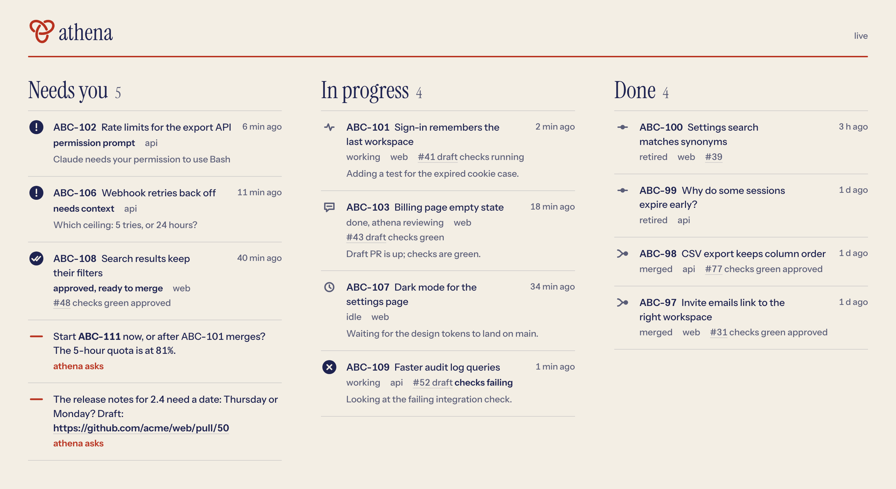

<picture>
  <source media="(prefers-color-scheme: dark)" srcset="assets/logo-lockup-dark.svg">
  
</picture>

A chief of staff for Claude Code in [herdr](https://herdr.dev). One Claude session named athena, in a herdr space of the same name, takes Linear tickets, launches a visible worker Claude for each in its own git worktree and herdr space, shows the workers as columns beside itself, and supervises them to merge-ready PRs. The human can type into any worker at any time.

## How it works


athena sits in its own space with the workers as columns beside it. It launches each ticket with a launch card, and when a worker gets stuck or finishes, a watch line appears and athena acts on it. When a worker needs a decision, athena asks you in its own pane and passes your answer on. Each worker is a full Claude session, so you can also type into its column directly.


A ticket becomes a brief and a worker in its own worktree. The worker builds, tests, pushes and opens a draft PR. athena checks CI, has a fresh reviewer read the diff, and sends findings back until the PR is ready. Then it asks you: you merge, or tell athena to.


`athena watch` prints one line per change, and athena reacts to each: it asks you about a blocked worker, sends a failed check back to its worker, starts a review on DONE, and asks a repo's workers to rebase when its main moves. Routine progress stays quiet.

## Use

- `prefix+shift+c` (or `athena hq`): open or focus the hq space. The chief of staff starts with its brief (`hq.md`) and the `athena` skill.
- Tell it what to start: "start abc-101 and abc-102". It reads Linear, writes a brief, shows a launch card, and runs `athena spawn`.
- `prefix+shift+r` (or `athena hq restart`): update Claude Code and its plugins, then restart HQ's Claude in the same pane on the same conversation; it runs its start routine by itself. HQ can run it about itself. Workers and the dashboard keep running.
- `prefix+shift+b` (or `athena board toggle`): show or hide the worker columns beside hq.
- `athena dash open`: the dashboard in your browser.

## Dashboard

<picture>
  <source media="(prefers-color-scheme: dark)" srcset="assets/dashboard-dark.png">
  
</picture>

While HQ is open, `athena dash` serves one page on `http://127.0.0.1:2843/`: what needs you (a blocked worker, a question, a PR ready for you, and athena's own asks from `needs-you.md`), what is in progress with its PR checks, and what was done in the last two weeks, each linked to its ticket and PR. It reads athena's state files only, makes no network calls, and updates by itself within a second of a change. `athena hq` starts it, and closing HQ's space stops it. It is a small Go program in `dash/`, built on first use (Go required); the plan and its failure modes are in [docs/dashboard.md](docs/dashboard.md).

## Commands

| Command | What it does |
|---|---|
| `athena preflight <repo>` | Main checkout clean, on main, fast-forwarded |
| `athena spawn --repo --branch --name --brief --goal ...` | Worktree space, worker Claude (`--name`, `worker.md`, per-worker settings), then its `/goal` |
| `athena status [--json] [--pr]` | Merged status: ATHENA-REPORT, hook state, git, PR, herdr |
| `athena board on\|off\|toggle\|sync\|show` | Attach columns beside hq; a watcher keeps them in step with width and workers |
| `athena dash on\|off\|show\|open` | The dashboard on 127.0.0.1; `show` prints its URL and pid |
| `athena watch` | One line per change, for Monitor; also saves its snapshot to `watch.json` for the dashboard |
| `athena pr <name>` | PR summary |
| `athena nudge <name> <text>` | Type a slash command into a worker |
| `athena resume <name>` | Send the goal of a worker that stopped at a startup prompt, once the human has answered it (`athena watch` does this on its own) |
| `athena retire <name> [--force] [--keep-worktree]` | Back up, refuse to lose work, stop, remove the worktree space |
| `athena hq` | Create or focus hq |
| `athena hq restart [--no-update]` | Detached: `claude update` and the user-scope plugin updates, `/exit` HQ's Claude, `--resume` its conversation in the same pane, prompt its start routine. A failed resume starts a fresh HQ and says so; log in `logs/hq-restart.log` |

## Pieces

- `athena_lib/`: stdlib Python 3.9+. State in `~/.local/state/athena/` (`ledger.jsonl`, `workers/`, `briefs/`, `settings/`, `claims/`, `board.json`, `hq.json`, and for the dashboard `watch.json`, `history.jsonl`, `needs-you.md`).
- `dash/`: the dashboard server, Go standard library only, with the Instrument fonts (OFL) embedded.
- `hooks/`: Claude Code plugin hooks that write `workers/<name>.json`; a no-op outside athena workers.
- `hq.md`, `worker.md`, `skills/athena/SKILL.md`: the prompts.
- `repos/<repo>.setup`: optional per-repo worktree setup (platform: env files, certs, `pnpm install`).
- The herdr auto-claude plugin skips spaces that `athena` claims (`~/.local/state/athena/claims/`).

## Install

```sh
ln -sf ~/Developer/athena/bin/athena ~/.local/bin/athena
claude plugin marketplace add ~/Developer/athena
claude plugin install athena@athena
```

## Test

`make test` (unit tests with a fake herdr, and `go test` for the dashboard). `tests/lab/` runs real workers against an isolated herdr server.

## Environment

`ATHENA_STATE_DIR`, `ATHENA_WORKTREE_ROOT` (default `~/Developer/.worktrees`), `ATHENA_HERDR`, `ATHENA_HQ` (default `athena`), `ATHENA_MIN_COL` (70), `ATHENA_MAX_WORKERS` (4, hard cap 6), `ATHENA_PLUGIN_DIR` (load the plugin from a directory in workers), `ATHENA_HQ_PANE`, `ATHENA_DASH_PORT` (2843), `ATHENA_LINEAR_WORKSPACE` (the Linear workspace in ticket links; or `linear_workspace` in `~/.local/state/athena/dash.json`; neither leaves ticket ids unlinked).

## Update after editing

The `athena` CLI and the prompt files (`hq.md`, `worker.md`) run from this repository. The hooks and the `athena` skill run from the plugin cache: bump `version` in `.claude-plugin/plugin.json`, then `claude plugin marketplace update athena && claude plugin update athena@athena`, and restart the sessions that should pick it up.
